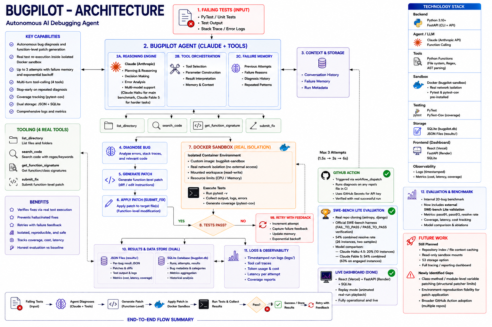

# BugPilot

**BugPilot is an autonomous AI debugging agent that diagnoses failing tests, investigates a codebase using real tools, generates targeted function-level patches, executes them inside a network-isolated Docker sandbox, and retries failed repairs — with exponential backoff and failure memory — using feedback from previous attempts.**

**🔗 Live dashboard: [https://bug-pilot-eight.vercel.app/](https://bug-pilot-eight.vercel.app/)** · API: https://bugpilot-8nbi.onrender.com/api/summary

*(Free-tier hosting — the API may take up to ~50 seconds to wake on first load after inactivity.)*



## Overview

Most demos of "AI that writes code" stop at generating a plausible-looking answer. BugPilot goes further: given a codebase with a failing test, it investigates the failure itself — reading files, searching code, and inspecting function signatures, all without being told where the bug is — proposes a fix, applies it, and **verifies the fix actually works** by re-running the real test suite inside an isolated, network-disabled sandbox. If the fix doesn't work, it retries with exponential backoff, carrying the memory of what didn't work into the next attempt.

BugPilot was evaluated three separate ways:
1. Against a one-shot Claude baseline on a 20-bug internal benchmark
2. Against **SWE-bench Lite**, the industry-standard external benchmark for AI coding agents, using real GitHub issues from real open-source projects
3. As a working **GitHub Action**, verified with a real, successful run on this repo

## Why BugPilot?

Anyone can paste an error into a chatbot and get a suggested fix. What's harder — and more representative of real engineering work — is a system that:

- Investigates a failure without being told where the bug is
- Verifies its own answer is actually correct, rather than just plausible
- Recovers from a wrong first attempt using structured, backed-off retries
- Runs in a genuinely isolated environment, with no network access during execution
- Reports honest, measured results — including on an external benchmark it can't grade itself on
- Works as real, reusable CI/CD tooling, not just a local script

## Architecture

The full system: a failing test feeds into the agent, which reasons with Claude, calls real investigation tools, generates a targeted patch, and verifies it inside a network-isolated Docker sandbox — retrying with backoff on failure, and logging every attempt to both JSON and SQLite. The same core diagnosis logic also powers a SWE-bench Lite evaluation pipeline and a GitHub Action for CI usage.

See `screenshots/architecture.png` for the full diagram. Key stages:

```
Failing test
    |
BugPilot Agent (Claude Haiku or Fable 5 + tools: list_directory, search_code,
                 get_function_signature, submit_fix)
    |
Diagnose bug -> Generate function-level patch -> Apply patch
    |
Docker sandbox (bugpilot-sandbox image, network-isolated)
    |
Run tests + collect coverage
    |
   Pass? --yes--> Done, results saved (JSON + SQLite)
    |no
    |
Retry with feedback (exponential backoff: 1.5s -> 3s -> 6s, max 3 attempts,
                      stops early if the same diagnosis repeats)
    |
    +----------------> back to Agent
```

## How It Works

1. **Run tests** inside an isolated, network-disabled Docker container — a failure here is the trigger for everything downstream.
2. **Investigate** — Claude may call `list_directory`, `search_code`, or `get_function_signature` to understand the codebase before deciding on a fix. This is a genuine multi-turn tool-calling loop, not a single request/response.
3. **Diagnose and generate a patch** — Claude identifies the single function responsible and returns the corrected version of just that function, not a full-file rewrite.
4. **Apply the patch** via a regex-based function-level find/replace, leaving the rest of the file untouched. The patcher handles both top-level functions and class methods, and correctly avoids duplicating decorators (`@staticmethod`, etc.) — a real bug found and fixed during SWE-bench testing.
5. **Re-run tests** (with coverage) inside the sandbox to verify the fix actually works.
6. **Retry if needed** — up to 3 attempts, each with exponential backoff (1.5s, 3s, 6s) and the full history of prior failed attempts, so the model doesn't repeat itself. If two consecutive attempts produce the same diagnosis, BugPilot stops early rather than burning a wasted third attempt.
7. **Record results** — every run writes to both a per-bug JSON file and a SQLite database, plus a timestamped log of the full run.

## Tool Calling

Early versions asked Claude to return a diagnosis and fixed code as free-text JSON. This broke on any code containing regex or backslashes — the escaping was unreliable. BugPilot instead uses the Anthropic API's structured tool-calling: a `submit_fix` tool with an explicit schema (`diagnosis`, `function_name`, `fixed_function_code`) that Claude fills in directly, guaranteeing well-formed output.

Beyond `submit_fix`, BugPilot offers three real investigation tools:
- **`list_directory`** — lists files in the bug's folder
- **`search_code`** — greps across files for a keyword or function name, returning file/line/text matches
- **`get_function_signature`** — returns just a function's signature line (not its full body), useful for quick context without pulling in a whole file

Claude genuinely chooses to use these mid-diagnosis on most bugs — confirmed by observing real tool calls in the run logs, not just wiring them up unused.

## Docker Sandbox

Every test run happens inside a custom-built image, `bugpilot-sandbox`, defined in the project's `Dockerfile`:

```dockerfile
FROM python:3.12-slim
RUN pip install --no-cache-dir pytest pytest-cov
WORKDIR /app
```

Pre-installing `pytest`/`pytest-cov` at build time (rather than at test-run time) means the container needs **no network access to run tests** — so every test run uses `network_disabled=True`, giving genuine network isolation. An earlier attempt to enable this on the stock `python:3.12-slim` image broke, because `pip install` at runtime needs network access; building a custom image with dependencies pre-baked was the correct fix.

The workspace is mounted read-write (patches need to be written to disk), but no external network access is available once the container starts.

## Patch Generation

BugPilot patches at the **function level**, not the file level. Early versions asked Claude to rewrite the entire file on every fix — this worked for small toy files but hit the model's output token limit on a real ~330-line production file. The fix: ask for only the one broken function, then splice it into the existing file via regex.

During SWE-bench testing, the patcher was extended twice more:
- To handle **class methods** (dotted names like `RST.__init__`, `Media.merge`), not just top-level functions
- To correctly preserve original decorators (`@staticmethod`, etc.) instead of duplicating them — a real bug that silently corrupted an entire file and broke unrelated tests, found by reading actual test failure logs rather than just the pass/fail count

It still cannot patch class-level attributes or module-level variables (e.g. Django's `FILE_UPLOAD_PERMISSIONS` setting) — these are structurally out of scope for a function-level patcher, and are documented as a known limitation rather than silently failing.

## Verification & Retry

A fix is only considered successful if the **real test suite passes** after it's applied — not because the patch "looks right." If tests still fail, BugPilot retries (up to `MAX_ATTEMPTS = 3`) with exponential backoff between attempts, passing the full history of prior diagnoses to the next attempt. If two consecutive attempts produce an identical diagnosis, BugPilot stops early rather than continuing to spin — a sign the agent is stuck, not making progress.

## Internal Benchmark (20 bugs)

20 reproducible bugs, each isolated in its own folder with a broken implementation and a test suite that exposes the defect:

| Category | Bugs |
|---|---|
| Arithmetic | 2 |
| Boundary / off-by-one | 3 |
| String logic | 2 |
| Python-specific gotcha | 1 |
| Data structures (list/dict/set) | 3 |
| Recursion | 2 |
| Exception handling | 2 |
| Algorithm (binary search) | 1 |
| Edge case (empty input) | 2 |
| Regression (real production code) | 2 |

One bug (`bug_09_ats_exact_match`) is not synthetic — it's a real function (`_exact_match`) extracted from **[Taylrd](https://github.com/Dev0602/taylrd)**, an AI resume-tailoring platform I built and shipped separately, with a realistic regression (loss of regex word-boundary matching) reintroduced.

**Result: 20/20 bugs fixed (100%)**, using the complete system — real network isolation, 4-tool investigation, coverage tracking, exponential backoff, and dual storage, all working together.

### Honest finding

BugPilot and a one-shot Claude baseline both achieved 100% on this 20-bug benchmark — this indicates the benchmark itself wasn't hard enough to show a raw accuracy advantage for the agentic approach. BugPilot's demonstrated value here is **automated execution-based verification, isolated patch application, and structured retry handling** — not a claimed accuracy improvement. This honest finding is exactly why the project was extended to SWE-bench Lite: an unverifiable 100% on a self-designed benchmark isn't a strong enough claim on its own.

## External Validation: SWE-bench Lite

[SWE-bench Lite](https://www.swebench.com/) is the industry-standard benchmark for AI coding/debugging agents — 300 real bugs pulled from real GitHub issues in large, well-known open-source Python projects (astropy, django, and others), each with the real human-written fix and a rigorous `FAIL_TO_PASS`/`PASS_TO_PASS` test-based grading criterion. Unlike the internal 20-bug benchmark, these instances are not self-designed, making the result independently credible.

**Setup:** cloned real repos at their exact pre-fix commits, fed the real GitHub issue text and the real (often 300+ line) buggy file to Claude, generated a patch via the same tool-calling + regex-patching pipeline as the main agent, and scored it using the **official SWE-bench evaluation harness** (not a custom checker).

**Real infrastructure work along the way:**
- SWE-bench's pre-built Docker images are x86_64-only; fixed by forcing the harness to build environments locally on Apple Silicon (`--force_rebuild --namespace none`)
- Validated the harness itself first by running it against the official gold (human-written) patches, before ever testing BugPilot's own output
- Found and fixed the decorator-duplication patching bug described above by reading real test failure logs, not just the pass/fail summary

### Results

| Model | Instances attempted | Resolved | Resolve rate |
|---|---|---|---|
| Claude Haiku 4.5 | 8/10 | 2/10 | 20% |
| Claude Fable 5 (sample 1) | 6/10 | 4/10 | 40% |
| Claude Fable 5 (sample 2) | 16/16 | 10/16 | 62.5% |
| **Combined (both Fable 5 samples)** | **22/26** | **14/22** | **54% overall · ~63% of engaged instances** |

**Headline result: 54% resolved across 26 attempted instances (two independent samples), with a consistent ~63% resolve rate whenever the model actually engages with an instance.** The convergence of this ~63% figure across two separate, non-overlapping instance sets (one mixed astropy/django, one all-django) is real evidence this reflects genuine capability, not a lucky sample.

### Honest failure analysis

Every non-resolution was investigated and categorized, not just counted:

- **Model refusals (~30–38% of instances, confirmed on two separate retries with identical results)** — Claude Fable 5 consistently declines to complete the tool call on certain instances. This is real, reproducible model behavior, not a bug in BugPilot's code, and is reported honestly rather than hidden or silently retried into a better-looking number.
- **Structural patcher limits** — module-level variables and class-level attributes can't be patched by a function-level patcher by definition (e.g. Django's `FILE_UPLOAD_PERMISSIONS`).
- **Environment-reproduction fragility** — one retry-with-feedback attempt produced a logically correct fix (verified by manually inspecting the diff) that still failed to *apply* inside the harness's exact environment, due to a subtle mismatch between the local checkout and the harness's internal canonical copy. This is a known class of fragility in diff-based patching, documented as a real limitation rather than pursued further by hand-editing.

## GitHub Action

BugPilot is also packaged as a reusable GitHub Action (`.github/actions/bugpilot-action/`), verified with a real, successful run — not just written and left untested.

**What it does:** given a target file, checks it out in CI, calls the real Anthropic API (via a GitHub Secret, never committed to code), and reports whether a bug was found — with a diagnosis if so.

**Real verified run:** triggered manually against this repo's own `tools.py` — succeeded end-to-end in ~14s, correctly reporting *"No bug found"* on genuinely clean, already-tested code (a true negative, not a hallucinated fix).

```yaml
# .github/workflows/bugpilot-check.yml
- name: Run BugPilot
  uses: ./.github/actions/bugpilot-action
  with:
    anthropic-api-key: ${{ secrets.ANTHROPIC_API_KEY }}
    target-file: tools.py
```

## Example Run

```
BUG: bugs/bug_09_ats_exact_match
==================================================
--- Attempt 1 of 3 ---
  (investigating: list_directory({}))
  (investigating: search_code({'keyword': 'def _exact_match'}))
Diagnosis: The function performs a naive substring match instead of
respecting word boundaries, causing partial matches like "js" to
match within "jsonify".
Patching function: _exact_match
SUCCESS after 1 attempt(s) | cost=$0.00674 | time=2.1s
```

## Project Structure

```
BugPilot/
├── agent.py               # Core agent: sandbox, tools, diagnosis, patching, retry loop
├── tools.py                 # read_file / write_file / list_directory / search_code / get_function_signature
├── db.py                     # SQLite storage (init_db, save_result, get_all_results)
├── api.py                     # FastAPI backend for the live dashboard
├── baseline.py                 # One-shot comparison system (no tools/sandbox)
├── run_baseline.py               # Runs the baseline across all bugs
├── reset_bugs.py                   # Restores all bugs to their broken state
├── swebench_batch_solve.py          # SWE-bench Lite integration: clone, diagnose, patch, format
├── Dockerfile                       # Custom sandbox image (pytest/pytest-cov pre-installed)
├── requirements.txt
├── .env.example
├── .gitignore
│
├── .github/
│   ├── workflows/bugpilot-check.yml    # Workflow that triggers the Action
│   └── actions/bugpilot-action/          # The reusable Action (action.yml + run_action.py)
│
├── bugs/
│   ├── bug_01_calculator/ ... bug_20_buzzword_detection/
│   └── (each: source file + test file)
│
├── results/
│   └── bug_XX.json          # Structured result per bug
│
├── logs/
│   └── run_TIMESTAMP.json     # Timestamped full-run logs
│
├── bugpilot.db                # SQLite database (all results, queryable)
│
├── frontend/
│   └── index.html                # Static dashboard: bug browser + benchmark comparison view
│
├── dashboard/
│   └── src/                        # Live React dashboard (deployed on Vercel), with replay mode
│
└── screenshots/
    └── architecture.png            # Architecture diagram
```

## Installation

```bash
git clone https://github.com/Dev0602/BugPilot.git
cd BugPilot
python3 -m venv venv
source venv/bin/activate
pip install -r requirements.txt
cp .env.example .env   # add your ANTHROPIC_API_KEY
docker build -t bugpilot-sandbox .
```

Requires Docker Desktop running locally.

## Running BugPilot

```bash
python3 agent.py
```

## Running the Baseline

```bash
python3 reset_bugs.py
python3 run_baseline.py
```

## Running the Benchmark

```bash
python3 reset_bugs.py
python3 agent.py        # writes results/*.json and bugpilot.db
open frontend/index.html
```

## Running SWE-bench Lite Evaluation

```bash
pip install swebench datasets
python3 swebench_batch_solve.py        # generates predictions for a sample of instances
python3 -m swebench.harness.run_evaluation \
  --predictions_path bugpilot_batch_predictions.json \
  --run_id my_run \
  --force_rebuild True \
  --namespace none
```

Note: this pulls real, large open-source repos and builds real Docker evaluation environments per instance — expect meaningful time (minutes per instance) and API cost, especially with larger models.

## Live Dashboard

Beyond the static `frontend/index.html`, BugPilot has a live, deployed dashboard: a React frontend backed by a FastAPI API that reads directly from `bugpilot.db`, including a **replay mode** that animates a real, completed repair run step-by-step (diagnose → patch → verify) using stored data — deliberately not a live-triggered run, to avoid public API cost/abuse risk.

**Architecture:**
```
React (Vercel) -> fetch -> FastAPI (Render) -> SQLite (bugpilot.db)
```

**Run it locally:**
```bash
# Terminal 1 — backend
python3 -m uvicorn api:app --reload --port 8000

# Terminal 2 — frontend
cd dashboard
npm install
npm start
```

**Deployed:**
- Backend (FastAPI): [Render](https://render.com) — free tier, running `uvicorn api:app --host 0.0.0.0 --port $PORT`
- Frontend (React): [Vercel](https://vercel.com) — free tier, root directory `dashboard`, auto-detected as Create React App
- `bugpilot.db` is committed to the repo so the deployed dashboard always shows real, seeded results — never an empty page
- Free-tier backend sleeps after inactivity; the frontend shows a loading message on cold start (~50s) rather than appearing broken

## Querying Results

Since results are stored in SQLite, they're directly queryable:

```python
import sqlite3
conn = sqlite3.connect("bugpilot.db")
conn.row_factory = sqlite3.Row
rows = conn.execute("""
    SELECT bug, attempts, cost_usd, coverage
    FROM results ORDER BY cost_usd DESC LIMIT 5
""").fetchall()
```

This surfaced a real finding: `bug_17_recursion` and `bug_08_factorial` are consistently BugPilot's two most expensive bugs to fix — reasoning about recursive base cases appears to require meaningfully more tokens than other bug categories.

## Limitations

- BugPilot currently modifies a single function or method at a time — it cannot patch module-level variables or class-level attributes.
- Multi-file dependency reasoning is not currently supported — no repository-wide index or file context cache.
- The sandbox workspace is mounted read-write, not read-only.
- Very large files (100K+ characters) increase cost and reduce reliability.
- Model refusals occur on a meaningful minority (~30–38%) of real-world SWE-bench instances, for reasons not fully understood.
- Diff-based patch application can fail due to environment-reproduction mismatches, independent of fix correctness.
- The live dashboard's backend runs on Render's free tier, which sleeps after inactivity.
- The GitHub Action has been verified on this repository; broader multi-repo adoption is a natural next step, not yet done.

## Future Work

- Repository index / file context caching (would require embeddings or vector search — a meaningfully larger subsystem, deliberately deferred)
- Read-only sandbox mounts where the patch target isn't the only file present
- S3 (or similar) storage option alongside local JSON/SQLite
- Class-level attribute and module-level variable patching (would require moving beyond regex to AST-based patching)
- Investigating the root cause of model refusals on certain SWE-bench instances
- Broader GitHub Action adoption across multiple real repositories
- Full tracing / reporting dashboard system beyond the current timestamped logs and SQL queries

---

Built by Baireddy Venkata Devendhar Reddy · [github.com/Dev0602](https://github.com/Dev0602)
